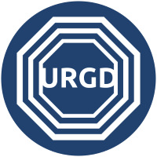

## UNDERGROUND (URGD) Token

UNDERGROUND is a deflationary reflection token with static reward system and burn mechanism.

Blockchain: Bitcoin Cash (smartBCH).

UNDERGROUND is a part of [Maze Tokens Underworld](https://mazetoken.github.io/urgd/)

[Telegram](https://t.me/mazetokens)

_Realizing that your power is hidden._
